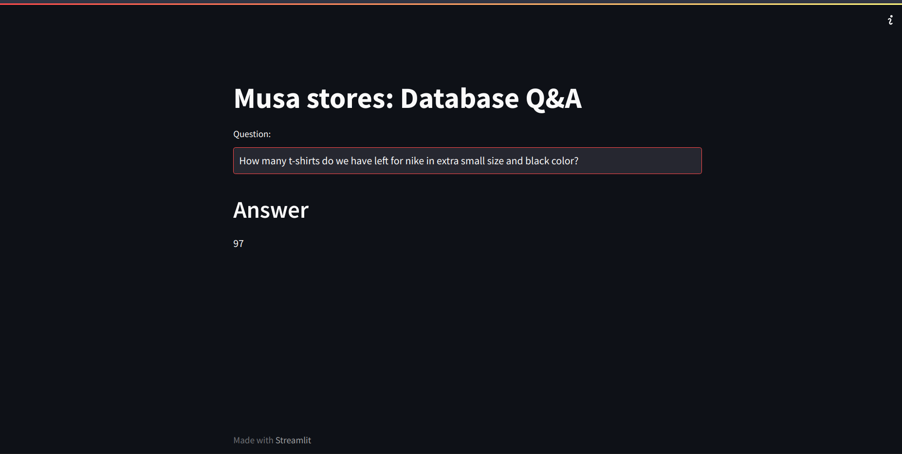
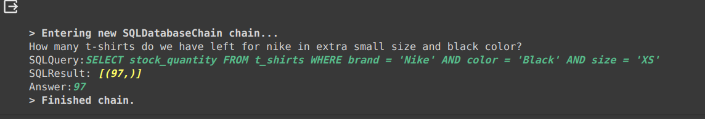
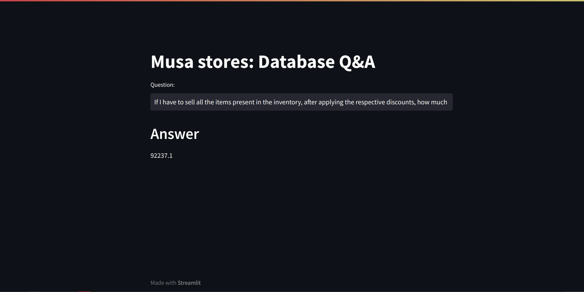
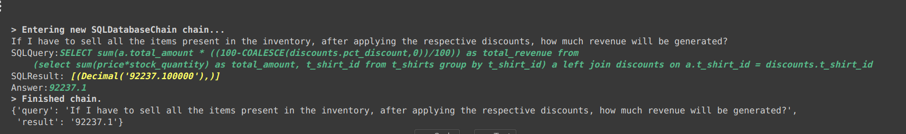

# Project Name: RetailTee - Interactive Database Exploration

## Overview
RetailTee is an innovative project that utilizes Google's Palm LLM to create a seamless interaction between users and a MySQL database hosted on a remote server provided by FreeSqlDatabase. With the integration of Langchain, Hugging Face embeddings, and Streamlit for UI, RetailTee enables users to pose natural language queries about the store's inventory, sales, and discounts data. The system intelligently translates these questions into SQL queries, executing them on the remote MySQL database to provide accurate and meaningful responses.

## Project Highlights
- **Store Details:** The retail store specializes in a variety of t-shirts.
- **Data Storage:** Inventory, sales, and discounts data are meticulously maintained in a MySQL database hosted on FreeSqlDatabase.
- **Key Components:**
  - Google Palm LLM for language understanding
  - Hugging Face embeddings for contextual representation
  - Streamlit for an intuitive and user-friendly interface
  - Langchain framework for enhanced language processing
  - Chromadb as a vector store for efficient data retrieval
  - Few shot learning for improved query accuracy

## Screenshots

1. **Streamlit App Interface:**
   - Screenshot showcasing the user interface of the Streamlit app. Demonstrates the natural language query input and the corresponding database results.


   
   *Displaying query result.*


2. **Sample Questions and Responses:**

   - Sample questions along with the system's responses to give users an idea of how to interact with RetailTee.
   
   *The natural language query from the UI.*
   
   - What it translates to...
   
   *Under the hood from the colab notebook*
   
   <br>
   - A little complex question

  
  - The SQL query it translates to 
  

## Usage
Coders can run the Streamlit app directly from a Colab notebook, requiring only a browser and an internet connection.

1. **Access the Colab Notebook:**
   - Open the provided [Colab notebook](run_app_in_colab.ipynb) in your browser.

2. **Run Streamlit App:**
   - Execute the relevant code cells to launch the Streamlit app directly within the Colab environment.
   - Enter the IP address in previous colab cell in the streamlit interface

3. **Interactive Querying:**
   - Interact with the system by asking questions in natural language through the intuitive Streamlit UI.

## Installation
1. **Clone Repository:**
   ```bash
   git clone https://github.com/zmusaddique/palm_for_clothing_store.git
   ```
2. **Navigate to Project Directory:**
   ```bash
   cd your_project
   ```
3. **Install Dependencies:**
   ```bash
   pip install -r requirements.txt
   ```
4. **Acquire API Key:**
   - Obtain an API key from [makersuite.google.com](https://makersuite.google.com) and add it to the `.env` file.
     ```env
     GOOGLE_API_KEY="your_api_key_here"
     ```

5. **Database Setup:**
   - Run the SQL script `musa_stores_tshirts_dbcreation.sql` in phpMyAdmin via [FreeSqlDatabase](https://www.freesqldatabase.com/) or MySQL Workbench.
   - Make sure you add your DB credentials in the .env file.

## Sample Questions
- How many total t-shirts are left in stock?
- How many t-shirts do we have left for Nike in XS size and white color?
- What is the total price of the inventory for all S-size t-shirts?
- How much sales amount will be generated if we sell all small size Adidas shirts today after discounts?

## Project Structure
- **main.py:** The main Streamlit application script.
- **langchain_helper.py:** Contains all the Langchain code for language processing.
- **requirements.txt:** List of required Python packages for the project.
- **few_shots.py:** Contains few shot prompts for enhancing query accuracy.
- **.env:** Configuration file for storing your Google API key.

Feel free to explore the intuitive UI and ask questions in natural language to interact with the remote database effortlessly. Happy querying!